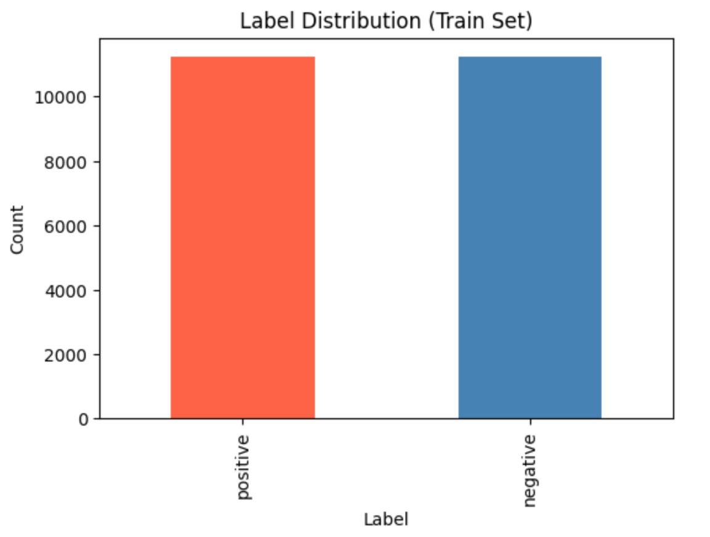
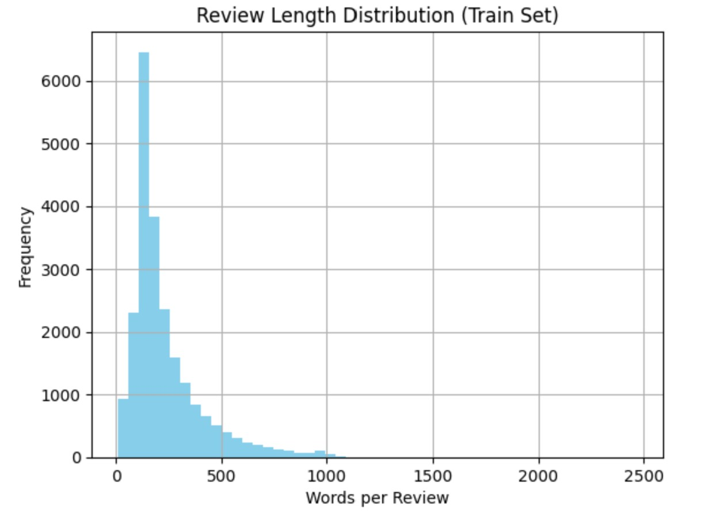

# IMDb Sentiment Classification via FastText & Autotune

This project is a technical implementation of a FastText sentiment analysis pipeline designed to classify movie reviews from the IMDb dataset as either positive or negative. The core of the project involves building a supervised machine learning model that leverages N-grams, subword information, and bag-of-words features to capture the nuances of sentiment in text. Initially, a baseline model failed to learn, performing at only 50% accuracy, which prompted the use of Autotune for hyperparameter optimization. By setting an optimization goal based on the F1 Score and conducting a structured 90/10 training-validation split, the final autotuned model achieved a significantly improved and perfectly balanced accuracy of 87.39%.

## Basic Information
**Names:** N M Emran Hussain  
**Email:** nmemranhussain2023@gmail.com  
**Date:** October 2025  
**Model Version:** 1.0.0  
**License:** [Apache License Version 2.0,](LICENSE)

## Intended Use
**Purpose:** The primary purpose of this project is to develop and evaluate a high-performance Sentiment Analysis Pipeline utilizing the FastText supervised learning library.  
**Intended Users:** The intended users of this project are Data Scientists, Machine Learning Engineers, and NLP Researchers, hiring managers or technical recruiters looking for an efficient, scalable template for text classification.  
**Out-of-scope Uses:** This project is not intended for end-consumers seeking a finished application, entities requiring multi-class sentiment detection, or organizations processing highly informal, short-form text, as the current model is a backend tool specifically optimized for binary classification of structured IMDb reviews.  

## Dataset
**Dataset Name:** [IMDb Large Movie Review Dataset.]([https://www.kaggle.com/c/titanic/data?select=train.csv](https://www.kaggle.com/datasets/lakshmi25npathi/imdb-dataset-of-50k-movie-reviews))
**Number of Samples:** The dataset contains a total of 50,000 highly polar movie reviews.The dataset is perfectly balanced, with 25,000 positive and 25,000 negative reviews.    
**Features Used:** The FastText sentiment analysis pipeline utilizes the raw text content of movie reviews as its primary input feature, paired with binary sentiment labels for classification. To enhance predictive accuracy, the model incorporates engineered features such as word bi-grams to capture contextual sentiment and subword information to better represent rare words or morphological patterns. Furthermore, the project leverages a bag-of-words approach, allowing the model to analyze the presence and frequency of specific terms within the reviews to distinguish between positive and negative sentiments.  
**Training Set (Approx. 90%):** 22,500 examples were used for the actual model training.  
**Validation Set (Approx. 10%):** 2,500 examples were set aside from the original training split to guide the Autotune hyperparameter optimization.  
**Test Set (50% of total):** 25,000 examples remained strictly for the final model evaluation to ensure unbiased performance metrics.  

### Data Dictionary

| Column Name     | Modeling Role  | Measurement Level | Description                            |
|-----------------|----------------|-------------------|----------------------------------------|
|Label	| Target (Dependent Variable)|	Nominal (Binary)	|The sentiment classification of the review. In the raw data, it is numeric (0 or 1). In the FastText format, it is converted to __label__negative or __label__positive.|  
|Text	| Feature (Independent Variable)	| Text / String	|The full string content of the movie review used for training and inference. This undergoes tokenization and N-gram processing during modeling.|

### Differences Between Training and Test Data
The project serves as a technical proof-of-concept for a FastText sentiment analysis pipeline that uses Autotune to transform an underfitting baseline model into an effective classifier with 87.39% accuracy. By training on a perfectly balanced IMDb dataset of 50,000 movie reviews, the model leverages word bi-grams and subword information to successfully distinguish between positive and negative sentiments. The structured workflow demonstrates a complete machine learning lifecycle, from exploratory data analysis and 90/10 data splitting to advanced hyperparameter optimization.  

## Model Details
### Model Architecture  
- **Core Algorithm:** The model employs a supervised learning approach designed for efficient text classification.  
- **Word Representation:** It uses a bag-of-words representation combined with n-gram features to capture the contextual meaning of phrases.  
- **Subword Information:** The architecture exploits subword information (character n-grams), allowing it to better understand rare words and morphological patterns.
- **Linear Classifier:** Internally, FastText uses a multinomial logistic regression (or a hierarchical softmax for large datasets) to map text embeddings to the target labels.

### Hyperparameter Optimization (Autotune)
The most critical aspect of the model's success was the application of Autotune, which dramatically improved performance from 50% to 87.39% accuracy.
- **Optimization Metric:** The search was guided to maximize the F1 score.
- **Duration:** The autotuning process was set to run for 600 seconds (10 minutes) to find a near-optimal configuration.
- **Initial Setup:** The baseline model used standard parameters which proved insufficient, leading it to perform no better than random chance.

### Evaluation Metrics  
- Accuracy, Precision, Recall and F1 Score

### Final Values of Metrics before and after Hyperparameter Optimization:  

|Metrics|BaseLine Model|Autotune Model|Improvement|Description|
|-------|--------------|--------------|-----------|-----------|
|Total Examples|25,000|25,000|-|-|
|Accuracy|0.5001|0.8739|+37.38%|87.39% of all reviews in the test set were classified correctly.|
|Precision|0.5001|0.8739|+37.38%|Out of all reviews the model predicted as positive, 87.39% were actually positive.|
|Recall|0.5001|0.8739|+37.38%|Out of all truly positive reviews, the model correctly identified 87.39%|
|F1 Score|0.5001|0.8739|+37.38%|This balanced score indicates the model has achieved a strong equilibrium between precision and recall across both classes.|

### Inputs and Outputs in the Model
**Model Inputs**
- **Raw Review Text:** The primary input is the full string content of the IMDb movie review.
- **Word N-grams:** During training, the model is configured to take word bi-grams (2-word sequences) as input features to better capture contextual sentiment, such as distinguishing "not good" from "good".
- **Subword Features:** The model breaks down input words into character n-grams, which allows it to handle rare words or spelling variations by looking at the components of the words. 
- **Hyperparameters (Autotune Input):** During the optimization phase, the model takes a validation file (imdb.valid) and a duration (e.g., 600 seconds) as inputs to automatically tune its internal settings.

**Model Output**
- **Sentiment Labels:** For each input review, the model outputs a predicted label, either __label__positive or __label__negative.
- **Confidence Scores:** Along with the label, the model outputs a probability score (ranging from 0 to 1) representing the model's confidence in that specific prediction.
- **Evaluation Metrics:** When tested against the test dataset, the model outputs a summary report containing Accuracy, Precision, Recall, and F1 Score.
- **Binary Binary/Internal Vectors:** Internally, the training process outputs a compressed model file (.bin), which contains the learned vector representations of the words and labels.

### Software Used to Implement the Model
- **Python:** The primary programming language used to develop the sentiment analysis pipeline.
- **FastText:** Used for supervised learning, model training, and performance evaluation. It provided the crucial Autotune feature for hyperparameter optimization.
- **Kaggle datasets:** Utilized to programmatically load and handle the IMDb dataset.
- **Pandas:** Used during the exploratory data analysis (EDA) phase to load FastText files and calculate basic statistics.
- **Matplotlib:** Employed to generate visualizations, such as label distribution and review length histograms.
- **Google Colab:** The environment used for running the Python notebooks and executing the machine learning pipeline.

### Key Tools and Methods
- **Unittest:** Python’s built-in testing framework was used to verify data formatting functions and model predictions.
- **Regex (re):** Used during data cleaning to remove FastText-specific labels from the text for analysis.
- **TSV (Tab-Separated Values):** The model required a specific data format (__label__<label>\t<text>), necessitating standard file I/O operations to convert raw text into the FastText format.

### Version of the Modeling Software: 
- **Python:** Python 3.12.
- **fasttext:** Version 0.9.3 was installed and utilized for model training and optimization.
- **numpy:** Version 1.26.4
- **pybind11:** Version 3.0.1
- **setuptools:** Version 75.2.0 

## Quantitative Analysis

### Plots Related to Data or Final Model
 
 

**Description**: This bar chart demonstrates that the training dataset is perfectly balanced, showing nearly identical counts of approximately 11,000 samples for both positive and negative sentiment labels.

 

**Description**: This histogram reveals a highly skewed distribution where the vast majority of movie reviews are under 400 words, though a "long tail" of data extends beyond 1,000 words.

## Potential Impacts, Risks, Uncertainties and Further Performance Improvement
The implementation of this sentiment analysis pipeline has significant potential impacts on the efficiency of text processing and customer feedback loops. By achieving an accuracy of 87.39%, the model demonstrates that automated classification can reliably replace manual review processes for large datasets. For organizations, this means the ability to process thousands of movie reviews or similar long-form feedback in seconds, enabling real-time sentiment tracking and faster decision-making based on audience reception. Furthermore, the use of Autotune establishes a high-performance baseline that can be adapted to other binary classification tasks, reducing the time and technical expertise required for manual hyperparameter tuning.
+1

Despite the high performance, there are inherent risks associated with model generalization and data bias. One primary risk is overfitting to the specific narrative style of the IMDb dataset, which may cause the model to perform poorly on shorter, noisier text like social media posts or slang-heavy chat logs. Additionally, while the dataset is perfectly balanced, there is a risk that the model might fail to capture subtle sarcasm or complex rhetorical structures that do not rely on traditional sentiment-bearing N-grams. If the model is used in a production environment without continuous monitoring, these failures could lead to misinterpretations of consumer sentiment, potentially impacting brand reputation or product strategy.

Several uncertainties remain regarding the model's scalability and its performance on evolving linguistic trends. It is uncertain how well the current word bi-gram approach will hold up as internet slang and review styles change over time. There is also uncertainty regarding the marginal gains of further optimization; while the project suggests pre-trained vectors or deeper Autotune searches as next steps, it is unclear if these will yield significant accuracy improvements without a substantial increase in computational cost. Finally, because the current pipeline is strictly optimized for binary classification, its utility in more nuanced environments—such as those requiring the detection of specific emotions like "anger" or "joy"—remains an unexplored variable.

To further boost model performance, we can focus on three main areas:
*First,* text normalization involves removing noise like stop words (e.g., "the," "a") and standardizing features by removing numbers or excessive punctuation, which helps FastText better capture core sentiment. *Second,* Leveraging Pre-Trained Vectors addresses FastText's knowledge deficit by initializing the model with embeddings trained on massive external corpora (like Wikipedia). This injects generalized linguistic knowledge, improving the model's understanding of rare or context-specific words and boosting generalization. *Third,* we can Deepen the Autotune Search by increasing the ‘autotuneDuration’ (e.g., to 1800 seconds) to find a more optimal configuration, and by allowing the search to explore higher N-gram sizes (up to N=4) to capture long, complex sentiment phrases within the reviews.
